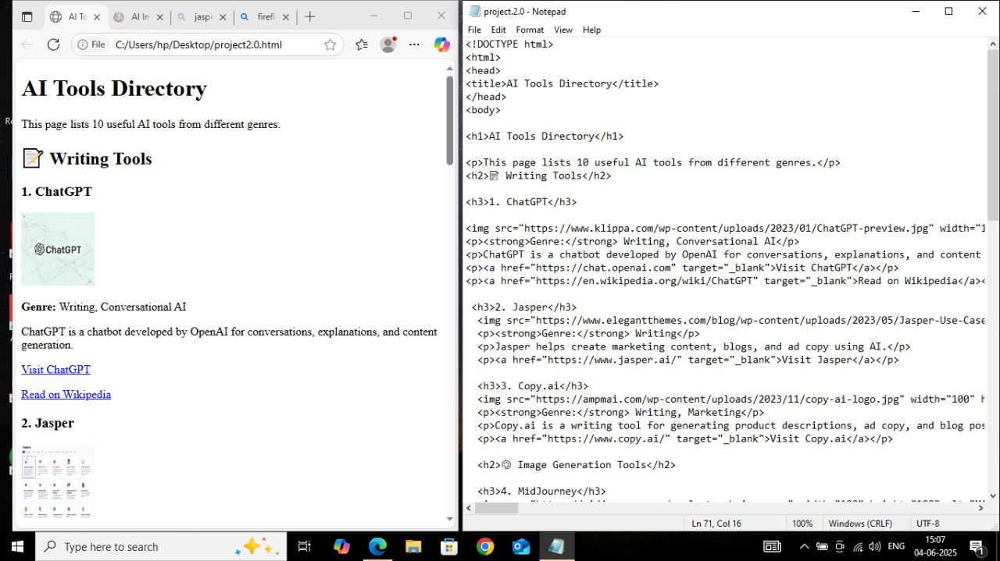

# 🌐 AI Tools Directory

A simple and beginner-friendly website that showcases 10 powerful and popular AI tools across different categories including writing, image generation, video editing, coding, and productivity.

This project was built as a learning exercise to improve HTML skills and understand basic website structure, image embedding, and linking.

---

## 🚀 Features

- ✅ Clean and organized layout using plain HTML
- ✅ Categorized AI tools by functionality
- ✅ Images and short descriptions for each tool
- ✅ External links to official tool websites and Wikipedia (where available)
- ✅ Responsive and easy-to-read content

---

## 🧠 Tools Included

### 📝 Writing Tools
- [ChatGPT](https://chat.openai.com/)
- [Jasper](https://www.jasper.ai/)
- [Copy.ai](https://www.copy.ai/)

### 🎨 Image Generation
- [MidJourney](https://www.midjourney.com/)
- [Leonardo AI](https://leonardo.ai/)

### 🎥 Video Tools
- [Runway ML](https://www.runwayml.com/)
- [Synthesia](https://www.synthesia.io/)
- [Pictory](https://pictory.ai/)

### 💻 Coding Assistant
- [GitHub Copilot](https://github.com/features/copilot)

### 📅 Productivity Tool
- [Fireflies AI](https://fireflies.ai/)

---
# Screenshot


## 📂 How to Use

1. Clone this repository:
   ```bash
   https://github.com/girishmohakar/Ai_tool_list/new/main?readme=1
